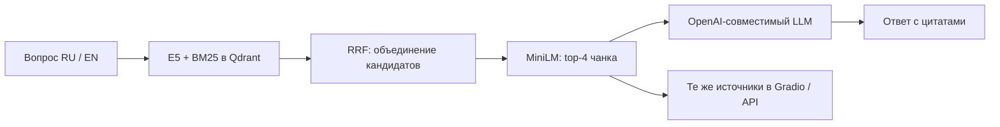

# scikit-learn docs RAG assistant

Локальный помощник по документации scikit-learn: отвечает на русском и английском, показывает пронумерованные источники со ссылками на разделы и выводит ответ постепенно. В браузере доступны Gradio, формулы, состояния запроса и время поиска и генерации; для интеграции — REST API FastAPI.

Примеры вопросов: «Как Lasso зануляет коэффициенты?», «Чем precision отличается от recall?», `How do I access a fitted transformer through Pipeline.named_steps?`

## Архитектура



Корпус — десять страниц документации scikit-learn 1.9: линейные модели, деревья, ансамбли, оценка моделей, кросс-валидация, подготовка данных, Pipeline, подбор параметров, пропуски и отбор признаков; дополнительно — [описание помощника](data/local/about.md). Проверенный снимок содержит 704 чанка. Загрузчик сохраняет заголовки, код, URL разделов и стабильные UUID.

На вопрос выполняется один поиск. До 20 dense- и 20 BM25-кандидатов объединяются серверным RRF, затем MiniLM выбирает четыре чанка. Их порядок одинаков в контексте LLM, цитатах и источниках. E5-small (`intfloat/multilingual-e5-small`, 384 измерения) использует `passage: ` для документов и `query: ` для вопросов. Reranker — `cross-encoder/mmarco-mMiniLMv2-L12-H384-v1`, CPU. Первый запуск требует интернета для загрузки весов; последующие используют кэш Hugging Face.

## Первый запуск: Anaconda Prompt

Нужны Anaconda, Docker с Compose для Qdrant и ключ OpenAI-совместимого LLM-провайдера. Команды выполняются из корня репозитория. Если окружение `sklearn-rag` уже существует, используйте его.

```bat
conda create -n sklearn-rag python=3.12 -y
conda activate sklearn-rag
python -m pip install -r requirements.txt
```

Для нового запуска скопируйте [.env.example](.env.example) в `.env` и заполните `LLM_API_KEY`. Существующий `.env` сохраняйте. Пример содержит настройки проверенного провайдера; для другого задайте его `LLM_BASE_URL` и `LLM_MODEL`. `.env` исключён из Git.

```bat
copy .env.example .env
```

После заполнения ключа:

```bat
docker compose up -d qdrant
python -m app.scripts.load_corpus
python -m app.scripts.index_corpus
python -m uvicorn app.main:app --host 127.0.0.1 --port 8000
```

Откройте [Gradio](http://127.0.0.1:8000/) или [API-документацию](http://127.0.0.1:8000/docs). Загрузка моделей при первом старте может занять несколько минут. Для разработки можно добавить `--reload`; новый процесс инициализирует модели заново.

В Gradio Enter и кнопка отправки используют общую очередь: один выполняемый запрос и до восьми ожидающих. Повторная отправка из одного чата блокируется на время обработки. При обрыве streaming частичный ответ и источники сохраняются, появляется отметка о незавершённом ответе. Показанное время запроса не включает ожидание в очереди. REST `/chat` работает независимо от этой очереди.

## Запуск в Docker

Подготовьте `.env` и заполните ключ, затем выполните:

```bat
docker compose build app
docker compose up -d qdrant
docker compose run --rm app sh -c "python -m app.scripts.load_corpus && python -m app.scripts.index_corpus"
docker compose up -d app
```

Compose задаёт приложению `QDRANT_URL=http://qdrant:6333`. Индекс сохраняется в `qdrant_data_v2/` на хосте. JSONL создаётся внутри временного контейнера и исчезает после индексации; работающему приложению нужен индекс Qdrant. Для переиндексации повторите `docker compose run`. Для CLI оценки используйте Anaconda: локальные JSONL, вопросы и отчёты не входят в образ приложения.

Остановка: `docker compose stop`. Каталог `qdrant_data_v2/` хранит рабочий индекс; старый `qdrant_data/` сохраняется отдельно.

## Готовность и API

| Запрос | Результат |
|---|---|
| `GET /health` | `200`: процесс работает |
| `GET /ready` | `200`: схема активного индекса совместима, RAG инициализирован; иначе `503` |
| `POST /chat` | JSON с `answer` и упорядоченными `sources`: `url`, `snippet` |

`/ready` проверяет индекс и локальные модели; доступность ключа, баланс и лимиты внешнего LLM проверяются при генерации. Вопрос `/chat` должен содержать от 1 до 500 символов и не состоять только из пробелов.

```bat
curl.exe http://127.0.0.1:8000/health
curl.exe http://127.0.0.1:8000/ready
curl.exe -X POST http://127.0.0.1:8000/chat -H "Content-Type: application/json" -d "{\"question\":\"What is Ridge regression?\"}"
```

## Переиндексация и восстановление

Для проверки существующего локального JSONL выполните `python -m app.scripts.index_corpus`. Для обновления корпуса остановите приложение, выполните `load_corpus`, затем `index_corpus` и запустите приложение снова. Загрузчик перезаписывает локальный JSONL; исходные локальные документы находятся в `data/local/`.

Физическая коллекция именуется по хешам корпуса и параметров индекса. Перед переключением alias `sklearn_docs` проверяются схема, векторы, UUID, тексты, metadata и пробный поиск. Повтор с теми же входами проверяет готовую коллекцию без перезаписи точек. Предыдущие коллекции сохраняются. Замена E5 или параметров её векторов требует нового индекса; смена reranker — перезапуска приложения. В `.env` доступны режимы `dense`, `hybrid`, `hybrid_rerank`.

| Симптом | Что проверить / сделать |
|---|---|
| Qdrant недоступен, `/ready` возвращает `503` | `docker compose up -d qdrant`; проверьте `QDRANT_URL` и `docker compose logs --tail 50 qdrant` |
| Индекс отсутствует или схема несовместима | Выполните `load_corpus` при отсутствии JSONL, затем `index_corpus`; проверьте `COLLECTION_NAME` и параметры E5 |
| Не загружаются E5 / MiniLM | Проверьте интернет, доступ к Hugging Face и место для кэша; после устранения причины повторите `/ready` |
| Ошибка LLM или незавершённый ответ | Проверьте ключ, URL, имя модели и лимиты провайдера; при ограничении дождитесь доступности и повторите запрос |
| Порт 8000 занят | Для Anaconda используйте `--port 8001` и соответствующий адрес браузера |

После восстановления Qdrant с совместимым индексом сервис повторно инициализирует RAG при проверке готовности. Для диагностики Docker-приложения: `docker compose logs --tail 50 app`. При изменении настроек перезапустите локальный процесс; в Docker выполните `docker compose up -d --force-recreate app`.

## Проверенные результаты

Числа относятся к сохранённым небольшим наборам. Параметры, хеши входов, версии и отдельные результаты находятся в JSON-отчётах. Машина: Windows 11, Intel Core i7-12700H, 20 логических CPU, около 16 ГиБ RAM; модели работали на CPU. Поиск и нагрузка измерены локально с Qdrant 1.19.1.

### Поиск

В наборе 30 вопросов: оцениваются 24 по корпусу (12 EN, 12 RU), 6 вне корпуса учитываются отдельно. Recall@4 — доля обязательных разделов в выдаче; MRR@4 — обратный ранг первого нужного раздела. Для четырёх составных вопросов проверяются обе части.

| Режим | Recall@4 | MRR@4 | RU Recall / MRR | Обе части найдены |
|---|---:|---:|---:|---:|
| Dense | 0,8542 | 0,8021 | 0,7500 / 0,7500 | 1/4 |
| Hybrid | 0,9167 | 0,8438 | 0,8750 / 0,7917 | 2/4 |
| Hybrid + MiniLM | **0,9375** | **0,9028** | **0,9167 / 0,9444** | 1/4 |

[Сравнение поиска](notebooks/retrieval_comparison_v1.json) сохранено в репозитории 30 сентября 2026; отдельная дата измерения в JSON не записана. В [сравнении эмбеддеров](notebooks/embedding_comparison_v1.json) E5-large дала те же Recall/MRR, увеличив p95 поиска с 2236,5 до 2917,8 мс и пик памяти сервиса с 2087 до 3978 МиБ. Поэтому используется small. Числа сверены 1 октября 2026.

### Нагрузочный smoke-test

30 сентября 2026: отдельный процесс на каждый уровень параллельности, два прогрева, три прохода по восьми вопросам (4 EN, 4 RU), 24 измеренных HTTP-запроса на уровень. E5, BM25, Qdrant и MiniLM настоящие, генерация заменена локальной заглушкой. Измеряется HTTP `/chat` целиком, включая поиск; время настоящего LLM сюда не входит.

| Среда | Параллельность | Успешных / ошибок | p50 / p95, мс | Пик сервиса, МиБ |
|---|---:|---:|---:|---:|
| Anaconda | 1 | 24 / 0 | 1956,9 / 2382,8 | 2327,9 |
| Anaconda | 4 | 24 / 0 | 6895,4 / 7648,1 | 2460,3 |
| Свежий Docker | 1 | 24 / 0 | 2055,2 / 2582,6 | 2038,7 |
| Свежий Docker | 4 | 24 / 0 | 8973,1 / 9454,0 | 2048,9 |

[Локальный отчёт](notebooks/service_smoke_v1.json), [чистая сборка и индексация с нуля](notebooks/fresh_setup_smoke_v1.json). Пик памяти включает весь процесс сервиса, исключает Qdrant; его память записана отдельно как снимок, не пик. Две независимые Gradio-сессии подтвердили последовательную обработку и корректность источников. Заполнение всех восьми мест очереди не измерялось. Методика и повторение — [smoke-test](docs/service_smoke.md).

### Ответы

1 октября 2026: шесть фиксированных вопросов, один поиск и одна генерация на каждый; 3 EN, 2 RU по корпусу и 1 RU вне корпуса. RAGAS 0.2.15 оценил сохранённые ответы и тот же контекст без повторного поиска или генерации: `strictness=1`, 18 последовательных вызовов, паузы 20 секунд, без повторов и исправления JSON. Параметры провайдера и модели сохранены в отчёте.

| Выборка | Оценено | Faithfulness | Answer Relevancy |
|---|---:|---:|---:|
| По корпусу | 5/5 | 0,9846 | 0,9404 |
| Отказ вне корпуса | 1/1 | 1,0000 | 0,0000 |

[Отчёт RAGAS с просмотром всех ответов](notebooks/answer_ragas_neuraldeep_v1.json). Нулевая relevancy не делает честный отказ ошибкой. Одна модель генерировала и оценивала ответы; это ограничение проверки. Faithfulness не проверяет полноту запроса и соответствие номера цитаты утверждению. Просмотр выявил неполные ответы про Pipeline/RandomizedSearchCV и OneHotEncoder, а также лишний английский текст в отказе.

Дополнительные отчёты собственного судьи помечены как частичные: [остановка при лимите](notebooks/answer_evaluation_v1.json), [оценки без требуемых объяснений](notebooks/answer_evaluation_neuraldeep_v1.json). Они не входят в таблицу RAGAS. Старый `notebooks/rag_metrics.json` — исторический результат другого прогона.

## Тесты и повтор проверок

```bat
conda activate sklearn-rag
python -m pytest -q
```

Обычные тесты не требуют Docker, весов моделей и внешнего LLM. На 1 октября 2026 в Anaconda прошли 190 тестов. CI настроен на тесты и Docker-сборку; результат удалённого запуска для финального коммита подтверждается отдельно после push / PR.

Для настоящих локальных проверок с готовым индексом:

```bat
python -m app.scripts.compare_retrieval
python -m app.scripts.smoke_service --output notebooks/service_smoke_repeat.json
python -m app.scripts.eval_answers --output notebooks/answer_evaluation_repeat.json
python -m app.scripts.eval_ragas --input notebooks/answer_evaluation_repeat.json --output notebooks/answer_ragas_repeat.json
```

Первые две команды не расходуют LLM-квоту. `compare_retrieval` заменяет свой отчёт после успешного прогона. Последние две расходуют до 12 и 18 новых вызовов соответственно; при лимите останавливаются и сохраняют частичный результат. Указывайте новые пути отчётов: сценарии оценки ответов защищают существующие файлы от перезаписи.

Проверенные среды: Anaconda Python **3.12.14** и Docker Python **3.11.16**. В обеих закреплены Gradio **6.28.0**, Qdrant server/client **1.19.1**; RAGAS — **0.2.15**. Локально PyTorch 2.14.0+cpu / sentence-transformers 6.0.1; в чистой сборке — 2.14.1+cpu / 6.1.0. Остальные зависимости заданы диапазонами, поэтому будущая установка может отличаться от сохранённых замеров.

## Ограничения

Корпус охватывает выбранные страницы, а не всю документацию scikit-learn. Для составного вопроса top-4 может покрыть только одну часть; полезно задавать части отдельно. Поиск возвращает кандидатов и вне корпуса, поэтому отказ зависит от поведения LLM. История чата отображается в интерфейсе, но каждый вопрос обрабатывается независимо: уточнения должны содержать нужные имена и условия.

Лимиты бесплатного провайдера и его задержка влияют на генерацию. При четырёх HTTP-запросах CPU-поиск заметно замедляется; версия рассчитана на локальное использование и небольшую демонстрацию. Проверка качества на шести ответах не гарантирует такой же результат на произвольных вопросах.

## Коротко для резюме

Разработал двуязычный RAG-сервис по документации scikit-learn: FastAPI, Gradio streaming, гибридный E5/BM25-поиск в Qdrant, RRF и MiniLM reranking, цитирование источников и проверка готовности. Проверил чистый Docker-запуск, параллельные запросы и качество поиска и ответов с RAGAS.
